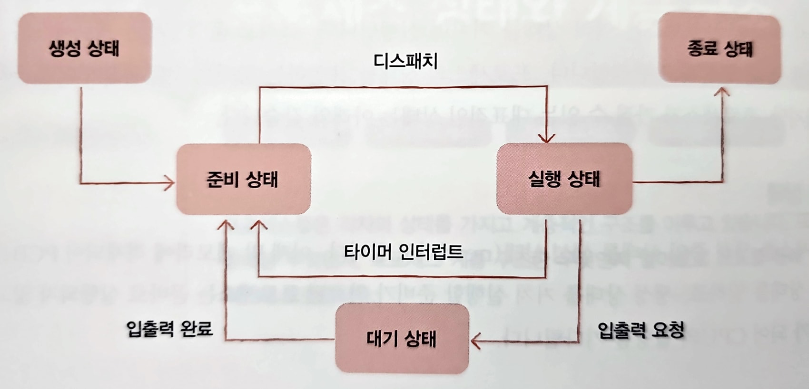
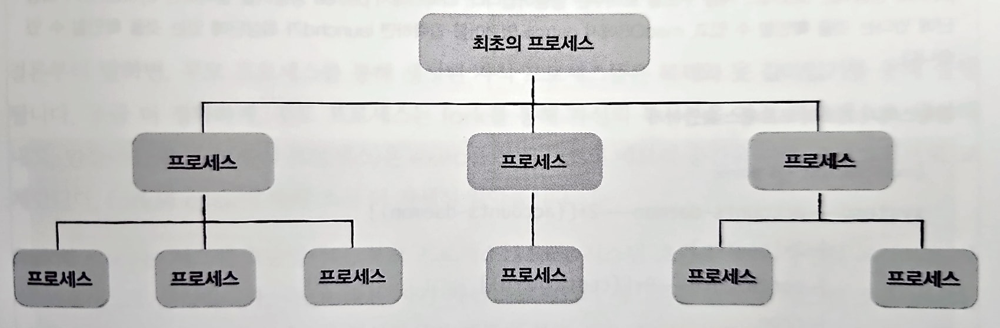

# CH 10. 프로세스와 스레드

## 10-1 프로세스 개요

### 프로세스

실행 중인 프로그램을 **프로세스**라 한다. 프로세스에는 사용자가 볼 수 있는 공간에서 실행되는 **포그라운드 프로세**스와 사용자가 보지 못하는 뒤편에서 실행되는 **백그라운드 프로세스**가 있다.

백그라운드 프로세스 중에는 사용자와 직접 상호작용할 수 있는 프로세스와 상호작용하지 않고 정해진 일만 수행하는 프로세스가 있다. 이러한 백그라운드 프로세스를 유닉스 체계의 운영체제에서는 **데몬**이라고 부르고, 윈도우 운영체제에서는 **서비스**라고 부른다.

### 프로세스 제어 블록

프로세스들은 차례대로 돌아가며 한정된 시간만큼만 CPU를 이용한다. 운영체제는 빠르게 번갈아 수행되는 프로세스의 실행 순서를 관리하고, 프로세스에 CPU를 비롯한 자원을 분배한다. 이를 위해 운영체제는 **프로세스 제어 블록**(**PCB**: Process Control Block)을 이용한다.

프로세스 제어 블록은 프로세스와 관련된 정보를 저장하는 자료 구조이다. PCB는 커널 영역에 생선된다. 운영체제는 수많은 프로세스들 사이에서 PCB로 특정 프로세스를 식별하고 해당 프로세스를 처리하는 데 필요한 정보를 판단한다. PCB는 프로세스 생성 시에 만들어지고 실행이 끝나면 폐기된다. 다시 말해 '새로운 프로세스가 생성되었다'는 말은 '운영체제가 PCB를 생성했다'는 말과 같고, '프로세스가 종료되었다'는 말은 '운영체제가 해당 PCB를 폐기했다'는 말과 같다. PCB에 담기는 정보는 대표적으로 아래와 같다.

#### 프로세스 ID

**프로세스 ID(PID)**는 특정 프로세스를 식별하기 위해 부여하는 고유한 번호이다. 같은 일을 수행하는 프로그램이라 할지라도 두번 실행하면 PID가 다른 두 개의 프로세스가 생성된다.

#### 레지스터 값

프로세스는 자신의 실행 차례가 돌아오면 이전까지 사용했던 레지스터의 중간값들을 모두 복원한다. 그래야만 이전까지 진행했던 작업들을 그대로 이어 실행할 수 있다. 그래서 PCB 안에는 해당 프로세스가 실행하며 사용했던 프로그램 카운터를 비롯한 레지스터 값들이 담긴다.

#### 프로세스 상태

현재 프로세스가 어떤 상태인지 PCB에 기록되어야 한다. 현재 프로세스가 입출력장치를 사용하기 위해 기다리고 있는 상태인지, CPU를 사용하기 위해 기다리고 있는 상태인지, 아니면 CPU를 이용하고 있는 상태인지 등의 프로세스 상태 정보가 PCB에 저장된다.

#### CPU 스케줄링 정보

프로세스가 언제, 어떤 순서로 CPU를 할당받을지에 대한 정보도 PCB에 기록된다.

#### 메모리 관리 정보

프로세스마다 메모리에 저장된 위치가 다른다. 그래서 PCB에는 프로세스가 어느 주소에 저장되어 있는지에 대한 정보가 있어야 한다. PCB에는 베이스 레지스터, 한계 레지스터 값과 같은 정보들이 담긴다. 또한 프로세스의 주소를 알기 위한 또 다른 중요 정보 중 하나인 페이지 테이블 정보도 PCB에 담긴다.

#### 사용한 파일과 입출력장치 목록

프로세스가 실행 과정에서 특정 입출력장치나 파일을 사용하면 PCB에 해당 내용이 명시된다. 즉, 어떤 입출력장치가 이 프로세스에 할당되었는지, 어떤 파일들을 열었는지에 대한 정보들이 PCB에 기록된다.

### 문맥 교환

하나의 프로세스 수행을 재개하기 위해 기억해야 할 정보를 **문맥**이라고 한다. 하나의 프로세스 문맥은 해당 프로세스의 PCB에 표현되어 있다. 인터럽트가 발생하면 실행중인 프로세스의 문맥을 PCB에 백업하고, 실행해야 할 프로세스의 문맥을 복구한다. 이것을 **문맥 교환**이라고 한다. 문맥 교환이 자주 일어나면 프로세스는 그만큼 빨리 번갈아 가며 수행되기 때문에 여러분의 눈에는 프로세스들이 동시에 실행되는 것처럼 보인다. 하지만 문맥 교환을 너무 자주하면 오버헤드가 발생할 수 있다.

### 프로세스의 메모리 영역

하나의 프로세스는 사용자 영역에 크게 **코드 영역, 데이터 영역, 힙 영역, 스택 영역**으로 나뉘어 저장된다.

#### 코드 영역

**코드 영역**은 **텍스트 영역**이라고도 부른다. 이곳에는 말 그대로 실행할 수 있는 코드, 즉 기게어로 이루어진 명령어가 저장된다. 코드 영역에는 데이터가 아닌 CPU가 실행할 명령어가 담겨 있기 때문에 읽기 전용 공간이다.

#### 데이터 영역

**데이터 영역**은 잠깐 썼다가 없앨 데이터가 아닌 프로그램이 실행되는 동안 유지할 데이터가 저장되는 공간이다. 이런 데이터로는 **전역 변수**가 대표적이다.

코드 영역과 데이터 영역은 그 크기가 변하지 않는다. 그래서 코드 영역과 데이터 영역은 **정적 할당 영역**이라고도 부른다.

#### 힙 영역

**힙 영역**은 프로그램을 만드는 사용자, 즉 프로그래머가 직접 할당할 수 있는 저장 공간이다. 프로그래밍 과정에서 힙 영역에 메모리 공간을 할당했다면 언젠가는 해당 공간을 반환해야 한다. 메모리 공간을 반환하는 것을 더 이상 해당 메모리 공간을 사용하지 않겠다는 것과 같다. 메모리 공간을 반환하지 않는다면 할당한 공간은 메모리 내에 계속 남아 메모리 낭비를 초래한다. 이런 문제를 **메모리 누수**라고 한다.

#### 스택 영역

**스택 영역**은 데이터를 일시적으로 저장하는 공간이다. 데이터 영역에 담기는 값과는 달리 잠깐 쓰다가 말 값들이 저장되는 공간이다. 이런 데이터로는 함수의 실행이 끝나면 사라지는 매개 변수, 지역 변수가 대표적이다.

힙과 스택 영역은 크기가 변할 수 있어 **동적 할당 영역**이라고도 부른다. 그래서 일반적으로 힙 영역은 메모리의 낮은 주소에서 높은 주소로 할당되고, 스택 영역은 높은 주소에서 낮은 주소로 할당된다. 그래야만 힙 영역과 스택 영역에 데이터가 쌓여도 새롭게 할당되는 주소가 겹칠 일이 없다.

## 10-2 프로세스 상태와 계층 구조

### 프로세스 상태

프로세스는 여러 상태를 거치며 실행된다. 운영체제는 프로세스의 상태를 PCB를 통해 인식하고 관리한다.

#### 생성 상태

프로세스를 생성 중인 상태를 **생성 상태**라고 한다. 이제 막 메모리에 적재되어 PCB를 할당 받은 상태를 말한다. 생성 상태를 거쳐 실행할 준비가 완료된 프로세스는 곧바로 실행되지 않고 준비 상태가 되어 CPU의 할당을 기다린다.

#### 준비 상태

**준비 상태**는 당장이라도 CPU를 할당받아 실행할 수 있지만 기다리고 있는 상태이다. 준비 상태 프로세스는 차례가 되면 CPU를 할당받아 실행 상태가 된다. 준비 상태인 프로세스가 실행 상태로 전환되는 것을 **디스패치**라고 한다.

#### 실행 상태

**실행 상태**는 CPU를 할당받아 실행 중인 상태를 의미한다. 실행 상태인 프로세스는 할당된 일정 시간 동안만 CPU를 사용할 수 있다. 할당된 시간을 모두 사용하면 다시 준비 상태가 되고, 실행 도중 입출력장치를 사용하여 입출력장치의 작업이 끝날 때까지 기다려야 한다면 대기 상태가 된다.

#### 대기 상태

프로세스는 실행 도중 입출력장치를 사용하는 경우가 있다. 입출력 작업은 CPU에 비해 처리 속도가 느리기에, 입출력 작업을 요청한 프로세스는 입출력장치가 입출력을 끝낼 때까지 기다려야 한다. 이렇게 입출력장치의 작업을 기다리는 상태를 **대기 상태**라고한다. 입출력 작업이 완료되면 해당 프로세스는 다시 준비 상태로 CPU 할당을 기다린다.

#### 종료 상태

**종료 상태**는 프로세스가 종료된 상태이다. 프로세스가 종료되면 운영체제는 PCB와 프로세스가 사용한 메모리를 정리한다.

아래는 프로세스 상태를 도표로 정리한 것이다.

위와 같은 도표를 **프로세스 상태 다이어그램**이라고 한다.

### 프로세스 계층 구조

프로세스는 실행 도중 시스템 호출을 통해 다른 프로세스를 생성할 수 있다. 이때 새 프로세스를 생성한 프로세스를 **부모 프로세스**, 부모 프로세스에 의해 생성된 프로세스를 **자식 프로세스**라고 한다.

부모 프로세스와 자식 프로세스는 엄연히 다른 프로세스이기에 각기 다른 PID를 가진다. 일부 운영체제에서는 자식 프로세스의 PCB에 부모 프로세스의 PID인 **PPID**가 기록되기도 한다. 자식 프로세스는 실행 과정에서 또 다른 자식 프로세스를 생성할 수 있다. 컴퓨터가 부팅될 때 실행되는 최초의 프로세스가 자식 프로세스들을 생성하고, 생성된 자식 프로세스들이 새로운 프로세스들을 낳는 형식으로 여러 프로세스가 동시에 실행되는 것이다.

이 과정을 도표로 그리면 아래와 같은 트리 구조를 띄는데, 이를 **프로세스 계층 구조**라고 한다.

### 프로세스 생성 기법

부모 프로세스는 **fork**를 통해 자신의 복사본을 자식 프로세스로 생성해내고, 만들어진 복사본(자식 프로세스)은 **exec**를 통해 자신의 메모리 공간을 다른 프로그램을 교체한다. exec를 호출하면 코드 영역과 데이터 영역의 내용이 실행할 프로그램의 내용으로 바뀌고, 나머지 영역은 초기화된다. 부모가 자식 프로세스를 실행하며 프로세스 계층 구조를 이루는 과정은 fork와 exec가 반복되는 과정이라 볼 수 있다.

부모 프로세스가 자식 프로세스를 fork한 뒤에 부모 프로세스, 자식 프로세스 누구도 exec를 호출하지 않는 경우도 있다. 이 경우 부모 프로세스와 자식 프로세스는 같은 코드를 병행하여 실행하는 프로세스가 된다.

## 10-3 스레드

**스레드**란 프로세스를 구성하는 실행의 흐름 단위이다. 하나의 프로세스는 여러 개의 스레드를 가질 수 있다. 스레드를 이용하면 하나의 프로세스에서 여러 부분을 동시에 실행할 수 있다.

### 프로세스와 스레드

한 번에 하나의 부분만 실행되는 프로세스들은 **단일 스레드 프로세스**라고 한다. **스레드**라는 개념이 도입되면서 하나의 프로세스가 한 번에 여러 일을 동시에 처리할 수 있게 되었다. 스레드는 프로세스 내에서 각기 다른 스레드 ID, 프로그램 카운터 값을 비롯한 레지스터 값, 스택으로 구성되어 스레드마다 각기 다른 코드를 실행할 수 있다.

중요한 점은 스레드들은 실행에 필요한 **최소한의 정보만을 유지한 채 프로세스 자원을 공유하며 실행**된다는 점이다. 프로세스의 자원을 공유한다는 것이 스레드의 핵심이다.

### 멀티프로세스와 멀티스레드

여러 프로세스를 동시에 실행하는 것을 **멀티프로세스**, 여러 스레드로 프로세스를 동시에 실행하는 것을 **멀티스레드**라고 한다.

프로세스끼리는 기본적으로 자원을 공유하지 않지만, 스레드끼리는 같은 프로세스 내의 자원을 공유한다. 프로세스를 fork하여 같은 작업을 하는 동일한 프로세스 두 개를 동시에 실행하면 코드 영역, 데이터 영역, 힙 영역 등을 비롯한 모든 자원이 복제되어 메모리에 적재된다. 이는 메모리 낭비로 볼 수 있다.

이에 반해 같은 프로세스 내의 모든 스레드는 동일한 주소 공간의 코드, 데이터, 힙 영역을 공유하고, 열린 파일과 같은 프로세스 자원을 공유한다. 여러 프로세스를 병행 실행하는 것보다 메모리를 더 효율적으로 사용할 수 있다. 또한 서로 다른 프로세스들은 자원을 공유하지 않기 때문에 독립적으로 실행되는 반면, 스레드는 프로세스의 자원을 공유하기 때문에 서로 협력과 통신에 유리하다.

프로세스의 자원을 공유한다는 특성은 때론 단점이 될 수 있다. 멀티프로세스 환경에서는 하나의 프로세스에 문제가 생겨도 다른 프로세스에는 지장이 적거나 없지만, 멀티스레드 환경에서는 하나의 스레드에 문제가 생기면 프로세스 전체에 문제가 생길 수 있다. 모든 스레드는 프로세스의 자원을 공유하고, 하나의 스레드에 문제가 생기면 다른 스레드도 영향을 받기 때문이다.
