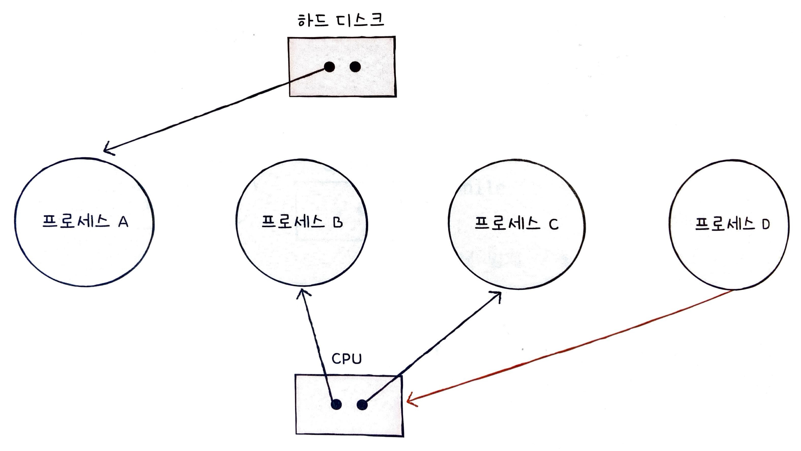

# CH 13. 교착 상태

## 13-1 교착 상태란

### 교착 상태

일어나지 않을 사건을 기다리며 진행이 멈춰 버리는 현상을 **교착 상태**라고 한다.

게임 프로세스는 자원 A를 점유한 채 웹 브라우저 프로세스가 점유하고 있는 자원 B의 사용이 끝나길 기다리고, 웹 브라우저 프로세스는 자원 B를 점유한 채 게임 프로세스의 자원 A 사용이 끝나길 기다리는 상황과 같다. 이 경우 게임과 웹 브러우저 프로세스는 상대방이 가진 자원을 기다리기만 하다가 결국 실행 한 번 못하는 상황이 벌어진다. 이를 교착 상태라고 한다.

교착 상태를 해결하기 위해서는 첫째, 교착 상태가 발생했을 때의 상황을 정확히 표현해 보고, 둘째, 교착 상태가 일어나는 근본적인 이유에 대해 알아야 한다.

### 자원 할당 그래프

교찫 상태는 **자원 할당 그래프**를 통해 단순하게 표현할 수 있다. 자원 할당 그래프는 어떤 프로세스가 어떤 자원을 사용하고 있고, 또 어떤 프로세스가 어떤 자원을 기다리고 있는지를 표현하는 간단한 그래프이다.

**첫째, 프로세스는 원으로, 자원의 종류는 사각형으로 표현한다.**

**둘째, 사용할 수 있는 자원의 개수는 자원 사각형 내에 점으로 표현한다.**

**셋째, 프로세스가 어떤 자원을 할당받아 사용 중이라면 자원에서 프로세스를 향해 화살표를 표시한다.**

**넷째, 프로세스가 어떤 자원을 기다리고 있다면 프로세스에서 자원으로 화살표를 표시한다.**

### 교착 상태 발생 조건

#### 상호 배제

한 프로세스가 사용하는 자원을 다른 프로세스가 사용할 수 없을 때, 즉 **상호 배제** 상황에서 교착 상태가 발생할 수 있다.

#### 점유와 대기

프로세스는 어떠한 자원을 할당받은 상태에서 다른 자원을 할당받기를 기다린다면 교착 상태가 발생할 수 있다. 이렇게 '자원을 할당받은 상태에서 다른 자원을 할당받기를 기다리는 상태'를 **점유와 대기**라고 한다.

#### 비선점

교착 상태가 발생하게 된 또 하나의 근본적인 문제는 프로세스가 자원을 **비선점**하고 있기 때문이다. 비선점 자원은 그 자원을 이용하는 프로세스의 작업이 끝나야만 비로소 이용할 수 있다. 즉, 어떤 프로세스도 다른 프로세스의 자원을 강제로 빼앗지 못했기 때문에 교착 상태가 발생했다고 볼 수 있다.

#### 원형 대기

자원 할당 그래프가 원의 형태로 그려지면 교착 상태가 발생할 수 있다. 이렇게 프로세스들이 원의 형태로 자원을 대기하는 것을 **원형 대기**라고 한다.

## 13-2 교착 상태 해결 방법

### 교착 상태 예방

**교착 상태를 예방**하는 방법은 교착 상태 필요 조건 네 가지 중 하나를 충족하지 못하게 하는 방법과 같다. 즉, 프로세스들에 자원을 할당할 때 상호 배제, 점유와 대기, 비선점, 원형 대기 중 하나의 조건이라도 만족시키지 않게 할당하면 교착 상태는 발생하지 않는다.

#### 상호 배제

자원의 상호 배제를 없앤다는 말은 모든 자원을 공유하게 만든다는 말과 같다. 이 방식대로면 이론적으로는 교착 상태를 없앨 수 있지만, 현실적으로 모든 자원의 상호 배제를 없애기는 어렵기에 이 방식을 현실에서 사용하기에는 다소 무리가 있다.

#### 점유와 대기

점유와 대기를 없애면 운영체제는 특정 프로세스에 자원을 모두 할당하거나, 아예 할당하지 않는 방식으로 배분한다.

이 방식도 이론적으로는 교착 상태를 해결할 수 있지만, 단점도 있다. 우선 자원의 활용률이 낮아질 우려가 있다. 점유와 대기를 금지하면 한 프로세스에 필요한 자원들을 몰아주고, 그 다음에 다른 프로세스에 필요한 자원들을 몰아줘야 한다. 이는 당장 자원이 필요해도 기다릴 수밖에 없는 프로세스와 사용되지 않으면서 오랫동안 할당되는 자원을 다수 양산하기 때문에 자원의 활용률이 낮아진다.

게다가 점유와 대기를 금지하면 많은 자원을 사용하는 프로세스가 불리해진다. 자원을 많이 사용하는 프로세스는 자원을 적게 사용하는 프로세스에 비해 동시에 자원을 사용할 타이밍을 확보하기가 어렵기 때문이다.

#### 비선점 조건

비선점 조건을 없애면 자원을 이용 중인 프로세스부터 해당 자원을 빼앗을 수 있어 교착 상태가 발생하지 않는다.

이 방식은 선점하여 사용할 수 있는 일부 자원에 대해서는 효과적이다. 가령 CPU는 프로세스들이 선점할 수 있는 대표적인 자원이다. 한 프로세스가 CPU를 이용하다가 일정 시간이 지나면 아직 작업이 모두 끝나지 않았다고 할지라도 다른 프로세스가 CPU를 할당받아 사용할 수 있기 때문이다.

하지만 모든 자원이 선점 가능한 것은 아니다. 한 프로세스의 작업이 끝날 때까지 다른 프로세스가 기다려야 하는 자원도 얼마든지 있다. 그렇기에 비선점 조건을 없애 모든 자원을 빼앗을 수 있도록 하여 교착 상태를 예방하는 방법은 다소 범용성이 떨어지는 방안이다.

#### 원형 대기

원형 대기를 없애는 방법은 간단하다. 모든 자원에 번호를 붙이고, 오름차순으로 자원을 할당하면 원형 대기는 발생하지 않는다.

원형 대기를 없애는 것은 앞선 세 방식에 비하면 비교적 현실적이고 실용적인 방식이지만, 역시 단점은 있다. 모든 컴퓨터 시스템 내에 존재하는 수많은 자원에 번호를 붙이는 일은 그리 간단한 작업은 아니거니와 각 자원에 어떤 번호를 붙이는지에 따라 특정 자원의 활용률이 떨어질 수 있다.

이렇듯 교착 상태의 발생 조건을 원천적으로 제거하여 교착 상태를 사전에 방지하는 에방 방식은 교착 상태가 발생하지 않음을 보장할 수는 있지만 여러 부작용이 따른다.

### 교착 상태 회피

**교착 상태 회피**는 교착 상태가 발생하지 않을 정도로만 조심 조심 자원을 할당하는 방식이다. 교착 상태 회피 방식에서는 교착 상태를 한정된 자원의 무분별한 할당으로 인해 발생하는 문제로 간주한다. 프로세스들에 할당할 수 있는 자원이 충분한 상황에서 프로세스들이 한두 개의 적은 자원만을 요구한다면 교착 상태는 발생하지 않는다.

교착 상태가 발생하지 않고 모든 프로세스가 정상적으로 자원을 할당받고 종료될 수 있는 상태를 **안전 상태**라고 부르고, 교착 상태가 발생할 수도 있는 상황을 **불안전 상태**라고 부른다.

**안전 순서열**은 교착 상태 없이 안전하게 프로세스들에 자원을 할당할 수 있는 순서를 의미한다. 안전 순서열대로 프로세스들에 자원을 배분하여 교착 상태가 발생하지 않는 상태를 **안전 상태**라고 한다.

반면 **불안전 상태**는 안전 순서열이 없는 상황이다. 시스템이 불안전 상태에 놓이면 교착 상태가 발생할 수 있는 위험이 있다.

운영체제가 교착 상태를 회피하기 위해서는 시스템 상태가 안전 상태에서 안전 상태로 움직이는 경우에만 자원을 할당하면 된다. 즉, 교착 상태 회피 방식은 항시 안전 상태를 유지하도록 자원을 할당하는 방식이라 보면 된다.

### 교착 상태 검출 후 회복

**교착 상태 검출 후 회복**은 교착 상태 발생을 인정하고 사후에 조치하는 방식이다. 운영체제는 프로세스들이 자원을 요구할 때마다 그때그때 모두 할당하며, 교착 상태 발생 여부를 주기적으로 검사한다. 그리고 교착 상태가 검출되면 그때 비로소 다음과 같은 방식으로 회복한다.

#### 선점을 통한 회복

**선점을 통한 회복**은 교착 상태가 해결될 때까지 한 프로세스씩 자원을 몰아주는 방식이다. 교착 상태가 해결될 때까지 다른 프로세스로부터 자원을 강제로 빼앗고 한 프로세스에 할당하는 방식이다.

#### 프로세스 강제 종료를 통한 회복

가장 단순하면서 확실한 방법이다. 운영체제는 교착 상태에 놓은 프로세스를 모두 강제 종료할 수도 있고, 교착 상태가 없어질 때까지 한 프로세스씩 강제 종료할 수도 있다. 전자는 확실하지만 그만큼 많은 프로세스들이 작업 내역을 잃게 될 가능성이 있고, 전자는 작업 내역을 잃는 프로세스는 줄일 수 있지만 교착 상태가 없어졌는지 확인하는 과정에서 오버헤드를 야기한다.
