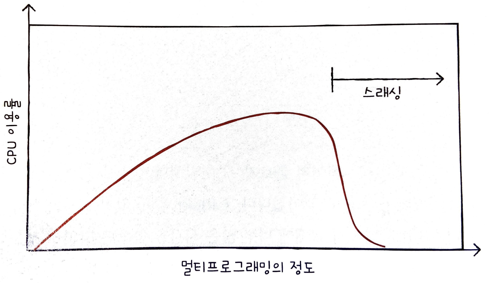

# CH 14. 가상 메모리

## 14-1 연속 메모리 할당

프로세스에 연속적인 메모리 공간을 할당하는 방식을 **연속 메모리 할당** 방식이라고 한다. 이번 절에서는 연속 메모리 할당 방식에서 무엇을 고려해야 하는지, 그리고 어떤 잠재적인 문제가 있는지 알아보겠다.

### 스와핑

메모리에 적재된 프로세스들 중에는 현재 실행되지 않는 프로세스가 있을 수 있다. 이런 프로세스들을 임시로 보조기억장치 일부 영역으로 쫓아내고, 그렇게 해서 생긴 메모리상의 빈 공간에 또 다른 프로세스를 적재하여 실행하는 방식을 **스와핑**이라고 한다.

이때 프로세스들이 쫓겨나는 보조기억장치의 일부 영역을 **스왑 영역**이라고 한다. 그리고 현재 실행되지 않는 프로세스가 메모리에서 스왑 역역으로 옮겨지는 것을 **스왑 아웃**, 반대로 스왑 영역에 있던 프로세스가 다시 메모리로 옮겨오는 것을 **스왑 인**이라고 한다. 스왑 아웃되었던 프로세스가 다시 스왑 인될 때는 스왑 아웃되기 전의 물리 주소와는 다른 주소에 적재될 수 있다.

스와핑을 이용하면 프로세스들이 요구하는 메모리 주소 공간의 크기가 실제 메모리 크기보다 큰 경우에도 프로세스들을 동시 실행할 수 있다.

### 메모리 할당

비어 있는 메모리 공간에 프로세스를 연속적으로 할당하는 방식에는 대표적으로 **최초 적합, 최적 적합, 최악 적합**의 세 가지 방식이 있다.

#### 최초 적합

**최초 적합**은 운영체제가 메모리 내의 빈 공간을 순서대로 검색하다가 적재할 수 있는 공간을 발견하면 그 공간에 프로세스를 배치하는 방식이다. 이 방식은 검색을 최소화할 수 있고 결과적으로 빠른 할당이 가능하다.

#### 최적 적합

**최적 적합**은 운영체제가 빈 공간을 모두 검색해 본 후, 프로세스가 적재될 수 있는 공간 중 가장 작은 공간에 프로세스를 배치하는 방식이다.

#### 최악 적합

**최악 적합**은 운영체제가 빈 공간을 모두 검색해 본 후, 프로세스가 적재될 수 있는 공간 중 가장 큰 공간에 프로세스를 배치하는 방식이다.

### 외부 단편화

연속 메모리 할당은 메모리를 효율적으로 사용하는 방법이 아니다. 연속 메모리 할달은 **외부 단편화**라는 문제를 내포하고 있기 때문이다.

프로세스들이 메모리에 연속적으로 할당되는 환경에서는 프로세스들이 실행되고 종료되기를 반복하며 메모리 사이 사이에 빈 공간들이 생긴다. 프로세스 바깥에 생기는 이러한 빈 공간들은 분명 빈 공간이지만 그 공간보다 큰 프로세스를 적재하기 어려운 상황을 초래하고, 결국 메모리 낭비로 이어진다. 이러한 현상을 **외부 단편화**라고 한다.

외부 단편화를 해결할 수 있는 대표적인 방안으로 메모리를 **압축**하는 방법이 있다. 메모리 조각 모음이라고도 부른다. 압축은 메모리 내에 저장된 프로세스를 재배치시켜 흩어져 있는 작은 빈 공간들을 하나의 큰 빈 공간으로 만드는 방법이다.

다만 압축 방식은 여러 단점이 있다. 빈 공간들을 하나로 모으는 동안 시스템은 한던 일을 중지해야 하고, 메모리에 있는 내용을 옮기는 작업은 많은 오버헤드를 야기하며, 어떤 프로세스를 어떻게 움직여야 오버헤드를 최소하하며 압축할 수 있는지에 대한 명확한 방법을 결정하기 어렵다.

## 14-2 페이징을 통한 가상 메모리 관리

**가상 메모리**는 실행하고자 하는 프로그램을 일부만 메모리에 적재하여 실제 물리 메모리 크기보다 더 큰 프로세스를 실행할 수 있게 하는 기술이다. 이를 가능케 하는 가상 메모리 관리 기법에는 크게 **페이징**과 **세그멘테이션**이 있다. 페이징 기법을 이용하면 물리 메모리보다 큰 프로세스를 실행할 수 있을 뿐만 아니라 외부 단편화 문제도 해결할 수 있다.

### 페이징이란

외부 단편화가 생긴 근본적인 이유는 각기 다른 크기의 프로세스가 메모리에 연속적으로 할당되었기 때문이다. 만일 메모리와 프로세스를 일정한 단위로 자르고, 이를 메모리에 불연속적으로도 할당할 수만 있다면 외부 단편화는 발생하지 않는다.

이것이 **페이징**이다. 페이징은 프로세스의 논리 주소 공간을 **페이지**라는 일정한 단위로 자르고, 메모리 물리 주소 공간을 **프레임**이라는 페이지와 동일한 크기의 일정한 단위로 자른 뒤 페이지를 프레임에 할당하는 가상 메모리 관리 기법이다.

페이징에서도 스와핑을 사용할 수 있다. 페이징을 사용하는 시스템에서는 프로세스 전체가 스왑 아웃/스왑 인되는 것이 아닌 페이지 단위로 스왑 아웃/스왑 인된다. 즉, 메모리에 적재될 필요가 없는 페이지들은 보조기억장치로 스왑 아웃되고, 실행에 필요한 페이지들은 메모리로 스왑 인되는 것이다. 페이징 시스템에서의 스왑 아웃은 **페이지 아웃**, 스왑 인은 **페이지 인**이라고 부르기도 한다.

한 프로세스를 실행하기 위해 프로세스 전체가 메모리에 적재될 필요가 없다는 말과 같다. 프로세스를 이루는 페이지 중 실행에 필요한 일부 페이지만을 메모리에 적재하고, 당장 실행에 필요하지 않은 페이지들은 보조기억장치에 남겨둘 수 있다. 이와 같은 방식을 통해 물리 메모리보다 더 큰 프로세스를 실행할 수 있다.

### 페이지 테이블

여기서 문제가 있다. 프로세스가 메모리에 불연속적으로 배치되면 CPU 입장에서 '다음에 실행할 명령어 위치'를 찾기가 어려워진다. 이를 해결하기 위해 페이징 시스템은 프로세스가 물리 주소(실제 메모리 내의 주소)에 불연속적으로 배치되더라도 논리 주소(CPU가 바라보는 주소)에는 연속적으로 배치되도록 **페이지 테이블**을 이용한다. 페이지 테이블은 현재 어떤 페이지가 어떤 프레임에 할당되었는지를 알려준다.

프로세스마다 각자의 페이지 테이블을 가지고 있고 각 프로세스의 페이지 테이블들은 메모리에 적재되어 있다. 그리고 CPU 내의 **페이지 테이블 베이스 레지스터(PTBR)**는 각 프로세스의 페이지 테이블이 적재된 주소를 가리킨다.

그런데 이렇게 페이지 테이블을 메모리에 두면 메모리 접근 시간이 두 배로 늘어난다. 메모리에 있는 페이지 테이블을 보기 위해 한 번, 그렇게 알게 된 프레임에 접근하기 위해 한 번, 이렇게 총 두 번의 메모리 접근이 필요하기 때문이다.

이 문제를 해결하기 위해 CPU 곁에 **TLB**라는 페이지 테이블의 캐시 메모리를 둔다. TLB는 페이지 테이블의 일부 내용을 저장한다. 참조 지역성에 근거해 주로 최근에 사용된 페이지 위주로 가져와 저장한다.

CPU가 발생한 논리 주소에 대한 페이지 번호가 TLB에 있을 경우 이를 **TLB 히트**라고 한다. 이 경우에는 페이지가 적재된 프레임을 알기 위해 메모리에 접근할 필요가 없다. 하지만 페이지 번호가 TLB에 없을 경우 페이지가 적재된 프레임을 알기 위해 메모리 내의 페이지 테이블에 접근해야 한다. 이를 **TLB 미스**라고 한다.

### 페이징에서의 주소 변환

하나의 페이지 혹은 프레임은 여러 주소를 포괄하고 있다. 그렇기에 특정 주소에 접근하려면 아래와 같은 두 가지 정보가 필요하다.

- 어떤 페이지 혹은 프레임에 접근하고 싶은지
- 접근하려는 주소가 그 페이지 혹은 프레임으로부터 얼마나 떨어져 있는지

그래서 페이징 시스템에서는 모든 논리 주소가 기본적으로 **페이지 번호**와 **변위**로 이루어져 있다. 변위는 접근하려는 주소가 프레임의 시작 번지로부터 얼마나 떨어져 있는지를 알기 위한 정보이다. 즉, 논리 주소 <페이지 번호, 변위>는 페이지 테이블을 통해 물리 주소 <프레임 번호, 변위>로 변환된다.

### 페이지 테이블 엔트리

페이지 테이블의 각각의 행들을 **페이지 테이블 엔트리**라고 한다. 페이지 테이블 엔트리에는 페이지 번호, 프레임 번호 외에도 다른 중요한 정보들이 있다. 대표적인 것이 유효 비트, 보호 비트, 참조 비트, 수정 비트이다.

#### 유효 비트

**유효 비트**는 현재 해당 페이지에 접근 가능한지 여부를 알려준다. 페이지 테이블 엔트리에서 프레임 번호 다음으로 중요한 정보라고도 볼 수 있다. 유효 비트는 현재 페이지가 메모리에 적재되어 있는지 아니면 보조기억장치에 있는지를 알려주는 비트이다. 페이지가 메모리에 적재되어 있다면 유효 비트가 1, 적재되어 있지 않다면 0이 된다.

만일 CPU가 유효 비트가 0인 페이지로 접근하려고 하면 **페이지 폴트**라는 예외가 발생한다. CPU가 페이지 폴트를 처리하는 과정은 하드웨어 인터럽트를 처리하는 과정과 유사하다.

1. CPU는 기존 기존의 작업 내역을 백업한다.
2. 페이지 폴트 처리 루틴을 실행한다.
3. 페이지 처리 루틴은 원하는 페이지를 메모리로 가져온 뒤 유효 비트를 1로 변경한다.
4. 페이지 폴트를 처리했다면 이제 CPU는 해당 페이지에 접근할 수 있게 된다

#### 보호 비트

**보호 비트**는 페이지 보호 기능을 위해 존재하는 비트이다. 보호 비트를 통해 해당 페이지가 읽고 쓰기가 모두 가능한 페이지인지, 혹은 읽기만 가능한 페이지인지를 나타낼 수 있다. 0일 경우 읽기만 가능하고, 1일 경우 읽고 쓰기가 모두 가능하다.

보호 비트는 읽기를 나타내는 r, 쓰기를 나타내는 w, 실행을 나타내는 x 세 개의 비트로 읽기, 쓰기, 실행하기 권한 조합을 나타낼 수도 있다.

#### 참조 비트

**참조 비트**는 CPU가 이 페이지에 접근한 적이 있는지 여부를 나타낸다. 적재 이후 CPU가 읽거나 쓴 페이지는 참조 비트가 1로 세팅되고, 적재 이후 한 번도 읽거나 쓴 적이 없는 페이지는 0으로 유지된다.

#### 수정 비트

**수정 비트**는 해당 페이지에 데이터를 쓴 적이 있는지 없는지 수정 여부를 알려준다. **더티 비트**라고도 부른다. 비트가 1이면 변경된 적이 있는 페이지, 0이면 변경된 적이 없는 페이지임을 나타낸다.

수정 비트는 페이지가 메모리에서 사라질 때 보조기억장치에 쓰기 작업을 해야 하는지, 할 필요가 없는지를 판단하기 위해 존재한다.

CPU는 메모리를 읽기도 하지만 메모리에 값을 쓰기도 한다. CPU가 한 번도 접근하지 않았거나 읽기만 한 페이지의 경우 보조기억장치에 저장된 해당 페이지의 내용과 메모리에 저장된 페이지 내용은 서로 같은 값을 가지고 있다. 따라서 수정된 적이 없는 페이지가 스왑 아웃될 경우 추가 작업 없이 새로 적재된 페이지로 덮어쓰기만 하면 된다.

하지만 쓰기 작업을 수행한 페이지의 경우 보조기억장치에 저장된 페이지의 내용과 메모리에 저장된 페이지의 내용은 서로 다른 값을 같게 된다. 따라서 수정된 적이 있는 페이지가 스왑 아웃될 경우 변경된 값을 보조기억장치에 기록하는 작업이 추가되어야 한다.

## 14-3 페이지 교체와 프레임 할당

### 요구 페이징

프로세스를 메모리에 적재할 때 처음무터 모든 페이지를 적재하지 않고 필요한 페이지만을 메모리에 적재하는 기법을 **요구 페이징**이라고 한다. 이름 그대로 실행에 요구되는 페이지만 적재하는 기법이다

요구 페이징의 기본 양상은 다음과 같다.

1. CPU가 특정 페이지에 접근하는 명령어를 실행한다.
2. 해당 페이지가 현재 메모리에 있을 경우(유효 비트가 1일 경우) CPU는 페이지가 적재된 프레임에 접근한다.
3. 해당 페이지가 현재 메모리에 없을 경우(유효 비트가 0일 경우) 페이지 폴트가 발생한다.
4. 페이지 폴트 처리 루틴은 해당 페이지를 메모리로 적재하고 유효 비트를 1로 설정한다.
5. 다시 1번을 수행한다.

아무런 페이지도 메모리에 적재하지 않은 채 무작정 실행부터 할 수도 있다. 이 경우 프로세스의 첫 명령어를 실행하는 순간부터 페이지 폴트가 발생하게 되고, 실행에 필요한 페이지가 어느 정도 적재된 이후부터는 페이지 폴트 발생 빈도가 떨어진다. 이를 **순수 요구 페이징**기법이라고 한다.

요구 페이징 시스템이 안정적으로 작동하려면 필연적으로 다음 두 가지를 해결해야 한다. 하나는 **페이지 교체**이고, 다른 하나는 **프레임 할당**이다.

메모리가 가득 찼을 때 메모리에서 보조기억장치로 내보낼 페이지를 결정하는 방법을 **페이지 교체 알고리즘**이라고 한다.

### 페이지 교체 알고리즘

일반적으로 페이지 폴트를 가장 적게 일으키는 알고리즘을 좋은 알고리즘으로 평가한다. 페이지 교체 알고리즘을 제대로 이해하려면 **페이지 폴트 횟수**를 알 수 있어야 한다. 그리고 페이지 폴트 횟수는 **페이지 참조열**을 통해 알 수 있다. 페이지 참조열은 CPU가 참조하는 페이지들 중 연속된 페이지를 생략한 페이지열을 의미한다.

연속된 페이지를 생략하는 이유는 중복된 페이지를 참조하는 행위는 페이지 폴트를 발생시키지 않기 때문이다. 페이지 교체 알고리즘을 평가할 때 고려할 것은 오직 페이지 폴트의 발생 횟수이다.

#### FIFO 페이지 교체 알고리즘

**FIFO 페이지 교체 알고리즘**은 이름 그대로 가장 먼저 올라온 페이지부터 내쫓는 방식이다.

### 최적 페이지 교체 알고리즘

**최적 페이지 교체 알고리즘**은 CPU에 의해 참조되는 횟수를 고려하는 페이지 교체 알고리즘이다. 앞으로의 사용 빈도가 가장 낮은 페이지를 교체하는 알고리즘이다.

최적 페이지 교체 알고리즘은 이름 그대로 가장 낮은 페이지 폴트율을 보장한다. 다만, 실제 구현이 어렵다. 프로세스가 앞으로 메모리 어느 부분을 어떻게 참조할지 미리 아는것은 현실적으로 불가능에 가깝다. 따라서 최적 페이지 교체 알고리즘은 그 자체를 운영체제에서 사용하기보다는, 주로 다른 페이지 교체 알고리즘의 이론상 성능을 평가하기 위한 목적으로 사용된다.

### LRU 페이지 교체 알고리즘

가장 오랫동안 사용되지 않은 페이지를 교체하는 알고리즘이다.

### 스레싱과 프레임 할당

페이지 폴트가 자주 발생하는 이유에 나쁜 페이지 교체 알고리즘만 있는 것은 아니다. 프로세스가 사용할 수 있는 프레임 수가 적어도 페이지 폴트는 자주 발생한다.

프로세스가 실제 실행되는 시간보다 페이징에 더 많은 시간을 소요하여 성능이 저해되는 문제를 **스래싱**이라고 한다.

메모리에서 동시에 실행되는 프로세스의 수를 **멀티프로그래밍의 정도**라고 한다. 이 그래프는 동시에 실행되는 프로세스의 수가 많다고 해서 CPU 이용률이 그에 비례해서 증가하는 것이 아님을 나타낸다. 동시에 실행되는 프로세스 수가 어느 정도 증가하면 CPU 이용률이 높아지지만, 필요 이상으로 늘리면 각 프로세스들이 사용할 수 있는 프레임 수가 적어지기 때문에 페이지 폴트가 빈번히 발생해 CPU 이용률이 떨어져 전체적인 성능이 저해된다.

스래싱이 발생하는 근본적인 원인은 각 프로세스가 필요로 하는 최소한의 프레임 수가 보장되지 않았기 때문이다. 그렇기에 운영체제는 각 프로세스들이 무리 없이 실행하기 위한 최소한의 프레임 수를 파악하고 프로세스들에 적절한 수만큼 프레임을 할당해 줄 수 있어야 한다.

### 프레임 할당 방식

모든 프로세스에 균등하게 프레임을 제공하는 방식을 **균등 할당**이라고 한다. 좋은 방법은 아니다.

프로세스의 크기에 따라 프레임을 나눠주는 방식을 **비례 할당**이라고 한다. 균등 할당과 비레 할당 방식은 프로세스의 실행 과정을 고려하지 않고 단순히 프로세스의 크기와 물리 메모리의 크기만을 고려한 방식이라는 점에서 **정적 할당 방식**이라고도 한다.

비레 할당도 완벽한 방식은 아니다. 프로세스의 크기가 크더라도 많음 프레임이 필요하지 않을 수도 있고 크기가 작더라도 프레임이 많이 필요할 수도 있다. 즉, 하나의 프로세스가 실제로 얼마나 많은 프레임이 필요할지는 결국 실행해봐야 안다.

프로세스를 실행하는 과정에서 배분할 프레임을 결정하는 방식에는 크게 **작업 집합 모델**을 사용하는 방식과 **페이지 폴트 빈도**를 사용하는 방식이 있다. 이 두 개 방식은 프로세스의 실행을 보고 할당할 프레임 수를 결정한다는 점에서 **동적 할당 방식**이라고도 한다.

**작업 집합 모델** 기반 프레임 할당 방식은 프로세스가 일정 기간 동안 참조한 페이지 집합을 기억하며 빈번한 페이지 교체를 방지한다. 참조 지역성의 원리를 이용한 것이다. 실행 중인 프로세스가 일정 시간 동안 참조한 페이지의 집합을 **작업 집합**이라고 한다. CPU가 과거에 주로 참조한 페이지를 작업 집합에 포함한다면 운영체제는 작업 집합의 크기만큼만 프레임을 할당해 주면 된다.

**페이지 폴트 빈도** 기반 프레임 할당 방식은 페이지 폴트율에 상한선과 하한선을 정하고, 이 범위 안에서만 프레임을 할당하는 방식이다.
