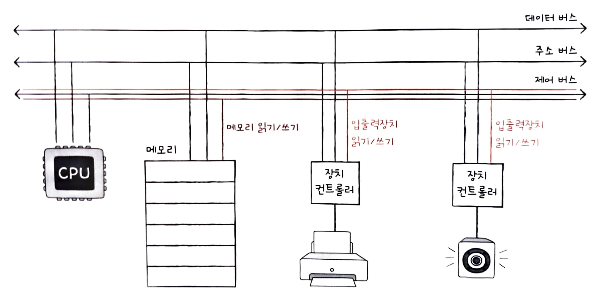

# CH 8. 입출력장치

## 8-1 장치 컨트롤러와 장치 드라이버

### 장치 컨트롤러

입출력 장치는 앞서 학습한 CPU, 메모리보다 다루기가 더 까다롭다

**첫째, 입출력장치에는 종류가 너무나도 많다.**

장치가 다양하며 자연스레 장치마다 속도, 데이터 전송 형식등도 다양하다. 따라서 다양한 입출력장치와 정보를 주고받는 방식을 규격화하기가 어렵다.

**둘째, 일반적으로 CPU와 메모리의 데이터 전송률은 높지만 입출력장치의 데이터 전송률은 낮다.**

여기서 **전송률**이란 데이터를 얼마나 빨리 교환할 수 있는지를 나타내는 지표이다. CPU와 메모리처럼 전송률이 노은 장치는 1초에도 수많은 데이터를 주고받을 수 있지만, 키보드나 마우스와 같이 상대적으로 전송률이 낮은 장치는 같은 시간 동안 데이터를 조금씩만 주고받을 수 있다. 전송률의 차이는 CPU아 메모리, 입출력장치 간의 통신을 어렵게한다. 물론 어떤 입출력장치는 CPU나 메모리보다 전송률이 높은 경우도 있다. 하지만 결과적으로 CPU나 메모리와 전송률이 비슷하지 않기 때문에 같은 어려움을 겪는다.

이와 같은 이유로 입출력장치는 컴퓨터에 직접 연결되지 않고 **장치 컨트롤러**라는 하드웨어를 통해 연결된다. 장치 컨트롤러는 **입출력 제어기, 입출력 모듈** 등으로 다양하게 불리기도 한다.

모든 입출력장치는 각자의 장치 컨트롤러를 통해 컴퓨터 내부와 정보를 주고받고, 장치 컨트롤러는 하나 이상의 입출력장치와 연결되어 있다. 장치 컨트롤러는 대표적으로 다음과 같은 역할을 통해 문제들을 해결한다.

- CPU와 입출력장치 간의 통신 중개
- 오류 검출
- 데이터 버퍼링

입출력장치 종류가 많아 정보 규격화가 어려웠던 문제는 장치 컨트롤러가 일종의 번역가 역할을 함으로써 해결할 수 있다. 그 과정에서 장치 컨트롤러는 자신과 연결된 입출력장치에 문제는 없는지 오류를 검출하기도 한다.

**버퍼링**이란 전송률이 높은 장치와 낮은 장치 사이에 주고받는 데이터를 **버퍼**라는 임시 저장 공간에 저장하여 전송률을 비슷하게 맞추는 방법이다. 쉽게 말해 버퍼링은 '버퍼에 데이터를 조금씩 모았다가 한꺼번에 내보내거나, 데이터를 한 번에 많이 받아 조금씩 내보내는 방법'이라고 보면 된다. 이를 **데이터 버퍼링**이라고 한다.즉, 장치 컨트롤러는 일반적으로 전송률이 높은 CPU와 일반적으로 전송률이 낮은 입출력장치와의 전송률 차이를 데이터 버퍼링으로 완화한다.

장치 컨트롤러는 **데이터 레지스터와 상태 레지스터, 제어 레지스터**로 구성되어 있다.

**데이터 레지스터**는 CPU와 입출력장치 사이에 주고받을 데이터가 담기는 레지스터이다. 즉, 버퍼 역할을 한다. 최근 주고받은 데이터가 많은 입출력장치에서는 레지스터 대신 RAM을 사용하기도 한다.

**상태 레지스터**에는 입출력장치가 입출력 작업을 할 준비가 되었는지, 입출력 작업이 완료되었는지, 입출력장치에 오류는 없는지 등의 상태 정보가 저장되고, **제어 레지스터**는 입출력장치가 수행할 내용에 대한 제어 정보와 명령을 저장한다.

이 레지스터들에 담긴 값들은 버스를 타고 CPU나 다른 입출력장치로 전달되기도 하고, 장치 컨트롤러에 연결된 입출력장치로 전달된다.

### 장치 드라이버

**장치 드라이버**란 장치 컨트롤러의 동작을 감지하고 제어함으로써 장치 컨트롤러가 컴퓨터 내부와 정보를 주고받을 수 있게 하는 프로그램이다. 프로그램이기에 당연히 실행 과정에서 메모리에 저장된다. 장치 컨트롤러가 입출력장치를 연결하기 위한 하드웨어적인 통로라면, 장치 드라이버는 입출력장치를 연결하기 위한 소프트웨어적인 통로이다.

컴퓨터가 연결된 장치의 드라이버를 인식하고 실행할 수 있다면 그 장치는 어떤 회사에서 만들어진 제품이든, 생김새가 어떻든 상관없이 컴퓨터 내부와 정보를 주고받을 수 있다. 반대로 장치 드라이버를 인식하거나 실행할 수 없는 상태라면 그 장치는 컴퓨터 내부와 정보를 주고받을 수 없다.

## 8-2 다양한 입출력 방법

### 프로그램 입출력

**프로그램 입출력**은 기본적으로 프로그램 속 명령어로 입출력장치를 제어하는 방법이다. CPU가 프로그램 속 명령어를 실행하는 과정에서 입출력 명령어를 만나면 CPU는 입출력장치에 연결된 장치 컨트롤러와 상호작용하며 입출력 작업을 수행한다. 프로그램 입출력 방식에서의 입출력 작업은 CPU가 장치 컨트롤러의 레지스터 값을 읽고 씀으로써 이루어진다.

CPU 내부에 있는 레지스터들과 달리 CPU는 여러 장치 컨트롤러 속 레지스터들을 모두 알고 있기란 어렵다. 그렇다면 명령어들은 어떻게 명령어로 표현되고, 메모리에 어떻게 저장되어 있을까? 여기에는 크게 두 가지 방식이 있다. 바로 **메모리 맵 입출력**과 **고립형 입출력**이다.

#### 메모리 맵 입출력

**메모리 맵 입출력**은 메모리에 접근하기 위한 주소 공간과 입출력장치에 접근하기 위한 주소 공간을 하나의 주소 공간으로 간주하는 방법이다. 가렬 1024개의 주소를 표현할 수 있는 컴퓨터가 있을 때 512개는 메모리 주소를, 512개는 장치 컨트롤러의 레지스터를 표현하기 위해 사용하는 것이다.

이때 중요한 점은 메모리 맵 입출력 방식에서 CPU는 메모리의 주소들이나 장치 컨트롤러의 레지스터들이나 모두 똑같이 메모리 주소를 대하듯 하면 된다는 점이다. 그래서 메모리에 접근하는 명령어와 입출력장치에 접근하는 명령어는 굳이 다를 필요가 없다.

#### 고립형 입출력

**고립형 입출력**은 메모리를 위한 주소 공간과 입출력장치를 위한 주소 공간을 분리하는 방법이다.

1024개의 주소 공간을 가진 컴퓨터가 있다고 가정해보자. 아래 그림처럼 제어 버스에 '메모리 읽기/쓰기' 선 이외에 '입출력장치 읽기/쓰기' 선이 따로 있다면 메모리에도 1024개의 주소 공간을 활용하고, 입출력장치도 1024개의 주소 공간을 활용할 수 있다.

고립형 입출력 방식에서 CPU는 입출력장치에 접근하기 위해 메모리에 접근하는 명령어와는 다른 입출력 명령어를 사용한다.

### 인터럽트 기반 입출력

입출력장치에 의한 하드웨어 인터럽트는 정확히 말하자면 입출력장치가 아닌 장치 컨트롤러에 의해 발생한다. CPU는 장치 컨트롤러에 입출력 작업을 명령하고, 장치 컨트롤러가 입출력장치를 제어하며 입출력을 수행하는 동안 CPU는 다른 일을 할 수 있다. 장치 컨트롤러가 입출력 작업을 끝낸 뒤 CPU에게 인터럽트 요청 신호를 보내면 CPU는 하던 일을 잠시 백업하고 인터럽트 서비스 루틴을 실행한다. 이렇게 인터럽트를 기반으로 하는 입출력을 **인터럽트 기반 입출력**이라고 한다.

여러 입출력장치에서 인터럽트가 동시에 발생한 경우에는 인터럽트들을 어떻게 처리해야 할까? 간단하게 생각하면 인터럽트가 발생한 순서대로 인터럽트를 처리하는 방법이 있다. 하지만 현실적으로 모든 인터럽트를 전부 순차적으로만 해결할 수 없다. 인터럽트 중에서도 더 빨리 처리해야 하는 인터럽트가 있기 때문이다. 즉, CPU는 인터럽트 간에 우선순위를 고려하여 **우선순위가 높은 인터럽트 순으로** 여러 인터럽트를 처리할 수 있다.

CPU가 인터럽트 A를 처리하는 도중에 또 다른 인터럽트 B가 발생했다고 했을때, A보다 B의 우선순위가 높다면 CPU는 인터럽트 A의 실행을 잠시 멈추고 인터럽트 B를 처리한 뒤 다시 A를 처리한다.

플래그 레지스터 속 인터럽트 비트가 활성화되어 있는 경우, 혹은 인터럽트 비트를 비활성화해도 무시할 수 없는 인터럽트인 **NMI**(Non-Maskable Interrupt)가 발생한 경우 CPU는 이렇게 우선순위가 높은 인터럽트부터 처리한다.

우선순위를 반영하여 다중 인터럽트를 처리하는 방법에는 여러 가지가 있지만, 많은 컴퓨터에서는 **프로그래머블 인터럽트 컨트롤러(PIC)**라는 하드웨어를 사용한다. **PIC**는 여러 장치 컨트롤러에 연결되어 장치 컨트롤러에서 보낸 하드웨어 인터럽트 요청들의 우선순위를 판별한 뒤 CPU에 지금 처리해야 할 하드웨어 인터럽트는 무엇인지를 알려주는 장치이다.

#### PIC의 다중 인터럽트 처리 과정

1. PIC가 장치 컨트롤러에서 **인터럽트 요청 신호(들)**를 받아들인다.
2. PIC는 인터럽트 우선순위를 판단한 뒤 CPU에 처리해야 할 **인터럽트 요청 신호**를 보낸다.
3. CPU는 PIC에 **인터럽트 확인 신호**를 보낸다.
4. PIC는 데이터 버스를 통해 CPU에 **인터럽트 벡터**를 보낸다.
5. CPU는 인터럽트 벡터를 통해 인터럽트 요청의 주체를 알게 되고, 해당 장치의 **인터럽트 서비스 루틴**을 실행한다.

일반적으로 더 많고 복잡한 장치들의 인터럽트를 관리하기 위해 PIC를 두 개 이상 계층적으로 구성한다. 참고로 PIC가 무시할 수 없는 인터럽트인 NMI까지 우선순위를 판별하지는 않는다. NMI는 우선순위가 가장 높아 우선순위 판별이 불필요하기 때문이다. PIC가 우선순위를 조정해 주는 인터럽트는 인터럽트 비트를 통해 막을 수 있는 하드웨어 인터럽트이다.

### DMA 입출력

프로그램 기반 입출력과 인터럽트 기반 입출력의 공통점은 입출력장치와 메모리 간의 데이터 이동은 CPU가 주도하고, 이동하는 데이터도 반드시 CPU를 거친다는 점이다. 하지만 입출력장치와 메모리 사이에 전송되는 모든 데이터가 반드시 CPU를 거쳐야 한다면 CPU는 입출력장치를 위한 연산 때문에 시간을 뺏기게 된다. 그래서 입출력장치와 메모리가 CPU를 거치지 않고도 상호작용할 수 있는 입출력 방식인 **DMA**(Direct Memory Access)가 등장했다. DMA는 이름 그대로 **직접 메모리에 접근**할 수 있는 입출력 기능이다. DMA 입출력을 하기 위해서는 시스템 버스에 연결된 **DMA 컨트롤러**라는 하드웨어가 필요하다.

#### DMA 입출력 과정

1. CPU는 DMA 컨트롤러에 입출력장치의 주소, 수행할 연산(읽기/쓰기), 읽거나 쓸 메모리의 주소 등과 같은 정보로 입출력 작업을 명령한다.
2. DMA 컨트롤러는 CPU 대신 장치 컨트롤러와 상호작용하며 입출력 작업을 수행한다. 이때 DMA 컨트롤러는 필요한 경우 메모리에 직접 접근하여 정보를 읽거나 쓴다.
3. 입출력 작업이 끝나면 DMA 컨트롤러는 CPU에 인터럽트를 걸어 작업이 끝났음을 알린다.

위 과정처럼 CPU는 DMA 컨트롤러에게 입출력 작업 명령을 내리고, 인터럽트만 받으면 되기 때문에 작업 부담을 훨씬 줄일 수 있다. 다시 말해 CPU는 오로지 입출력의 시작과 끝에만 관여하면 된다.

여기서 문제가 있다. DMA 컨트롤러는 시스템 버스로 메모리에 직접 접근이 가능하지만, 시스템 버스는 동시 사용이 불가능하다. 시스템 버스는 공용 자원이기 때문이다. 그래서 DMA 컨트롤러는 CPU가 시스템 버스를 이용하지 않을 때마다 조금씩 시스템 버스를 이용하거나, CPU가 일시적으로 시스템 버스를 이용하지 않도록 허락을 구하고 시스템 버스를 집중적으로 이용한다. 이러한 DMA의 시스템 버스 이용을 **사이클 스틸링**이라고 부른다.

#### 입출력 버스

DMA를 위해 시스템 버스를 너무 자주 사용하면 그만큼 CPU가 시스템 버스를 이용하지 못한다. 이 문제는 DMA 컨트롤러와 장치 컨트롤러들을 **입출력 버스**라는 별도의 버스에 연결하여 해결할 수 있다. 아래 그림과 같이 장치 컨트롤러들이 시스템 버스가 아닌 입출력 버스로 DMA 컨트롤러에 연결된다면 DMA 컨트롤러와 장치 컨트롤러가 서로 데이터를 전송할 때는 시스템 버스를 이용할 필요가 없으므로 시스템 버스의 사용 빈도를 줄일 수 있다.

입출력 버스에는 **PCI 버스, PCI Express(PCIe) 버스** 등 여러 종류가 있다. 여러 입출력장치들을 PCIe 버스와 연결해 주는 통로를 **PCIe 슬롯**이라고 한다.
